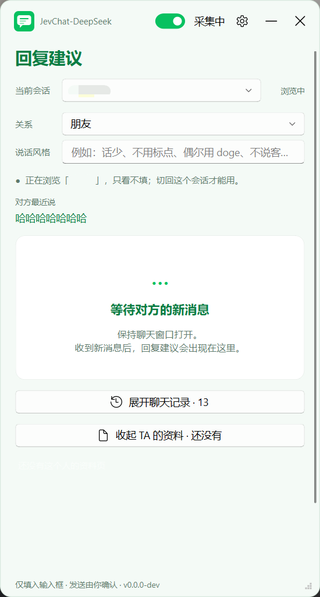

# JevChat-DeepSeek

聊天窗口旁挂的回复辅助：本地 OCR 读屏上的对话 → 判断意图/情绪 → 给出 3 条候选回复 →
一键填入输入框。每条候选下面还有一行小字，说清这条在做什么、在避什么坑。

**发送永远手动，程序不替你按发送。**

判断和起草都走通用大模型，默认 DeepSeek，只用一把 key。

采集是「截自己的聊天窗口 + 本地离线 OCR」，判断是「题库渲染成提示词让模型逐题作答」，
两件事都在本机完成，截图不落盘、不上传。



## 跑起来

**下载压缩包，解压，双击 `JevChat-DeepSeek.exe`。不用装 Python。**

到 [Releases](../../releases/latest) 下最新的 `JevChat-DeepSeek-vX.Y.Z.zip`，解压到任意目录——
**整个文件夹一起用**，exe 要靠旁边的那些文件。产物没有代码签名，SmartScreen 会拦一下：
「更多信息」→「仍要运行」。

要求：Windows 10 1903+ / 11，聊天窗口开着，两把 API key（判断一个、起草一个，见下）。
两个 key 填同一个值也行——判断默认也用 DeepSeek。

首次启动会弹设置页，在「模型」卡片里填两把 key（判断一把、起草一把；填同一个值也行）。
**key 和各设置一起存在 exe 旁边的 `config.json`**，不写环境变量、不碰注册表，整个文件夹拷走
设置也跟着走。

### 从源码跑（想改代码才需要）

要求 Python 3.10–3.12。

```bash
python -m venv .venv
.venv\Scripts\python -m pip install -i https://pypi.tuna.tsinghua.edu.cn/simple -r requirements.txt
.venv\Scripts\python main.py
```

用清华源是因为 `pypi.org` 在国内经常慢到装不动（PySide6 一棵依赖树要等十几分钟）。
源码跑时 `config.json` 落在项目根，同样不进版本库。

> 命令行脚本（`tools/demo.py`、`probe/*`）不走界面，仍然读环境变量
> `JEV_API_KEY` / `LLM_API_KEY`——那是给开发用的，普通使用不用管。

## 使用说明

**界面语言**

设置页顶部可选择「简体中文 / English」，选择后立即生效并自动保存，无需重启。
切换语言会同步刷新主界面和调试窗口，保留正在填写的设置、聊天记录和回复候选。
如果设置了 `JEVCHAT_LANG` 环境变量，下次启动仍以该变量指定的语言为准。

**第一次启动**

设置页的「模型」卡片分两节，各填一把 key：

1. **判断 · 模型** —— 判断意图、紧张度，并给三条候选排序。默认 **DeepSeek 官网**直连，
   key 在 [platform.deepseek.com](https://platform.deepseek.com/) 申请。地址可以用环境变量
   `JEV_BASE_URL` 指向本机任何 OpenAI 兼容端点（Ollama 之类），这样判断完全不出本机。
2. **起草 · 语言模型** —— 写那三条候选。默认 **DeepSeek 官网**直连，key 在
   [platform.deepseek.com](https://platform.deepseek.com/) 申请（很便宜，起草一次几厘钱）。
   换别家见下面的表，OpenAI / Anthropic / Gemini 三种接口都支持。
3. 保存。可以用了。

「关系」和「说话风格」不在这儿——它们**按会话单独设**，在主面板「当前会话」下面那两行。
给谁设就是给谁设，换个人说话不用来回改。

两把 key 各管一节，互不相干；同一节里换来源要重填一次 key（只存这一把）。

**为什么起草默认 DeepSeek 官网直连**

起草是两次网络调用里重的那次。OpenRouter 在国外，从国内过去要等好几秒、还时不时抽风；
DeepSeek 官方 API（`api.deepseek.com`）国内直连，起草基本就是一次 HTTP 请求的时间，体感差好几倍。
所以起草默认就是它，不用改。

判断那一步比起草轻得多，慢一点无所谓；想更快就把 `JEV_BASE_URL` 指向本机的兼容端点
（那是环境变量，只影响判断地址，跟 key 无关）。

**日常怎么用**

- 聊天窗口开着、别最小化（用别的窗口盖住没事），把要聊的会话点开
- 对方来一条消息 → 悬浮窗几秒后给判断摘要 + 三条候选（带判断给的胜出概率）
- 点「填入」→ 文字进输入框 → **你自己看一眼、改一改、按发送**。程序永远不碰发送
- 你切到哪个会话，悬浮窗就跟到哪个；群聊会带上发言人名，想指定回复给谁去设置里开「群聊指定回复对象」
- 暂时不想让它读聊天：标题栏开关拨到「已暂停」

**花多少钱**

只有对方来新消息才调一次模型：一次起草（DeepSeek Flash）+ 一次判断，十分钟没人说话就是十分钟零调用。
思考模式默认关，别开——起草三句话用不上，慢好几倍还贵。

## 支持的聊天软件

**只支持微信。**

| 软件 | OCR | 自己的气泡 | 窗口 |
|---|---|---|---|
| 微信 | RapidOCR（中英文模型，离线） | 绿色 | 标题为「微信」的主窗口 |

QQ、TIM、钉钉、飞书、Telegram、Discord、Slack 这些**都不支持**——不是「没测过」，
是没写：程序按进程名认窗口（`app/chatapps.py` 的 `exes`），表里没有的名字一律认不出，
界面会直接显示「未找到聊天窗口」。加一个得写一份 profile 并**对着活窗口实测**
（气泡颜色、置顶公告、窗口选择都要量出来），不是填个 exe 名就完事。

## 功能

- **跟着当前会话走**：会话名从面板头部 OCR 出来，记录、上下文、候选都按会话分开存；也可以自己
  在下拉框里选另一个会话，翻它的记录和上次的建议（那会儿只能看不能填）。
- **群聊**：每条消息前面的发言人名会一起喂给模型，所以它知道哪句是谁说的；打开「群聊指定回复对象」
  还能选回复给谁，三条候选都按 TA 写，填入时可带「@名字 」前缀（纯文本）。
- **3 条候选**：每条带判断给的胜出概率百分比，按概率排序，推荐那条置顶并标「推荐回复」；
  每条都有「填入」和复制按钮。
- **判断摘要**：建议动作、可能意图、对方可能需要、紧张度 0–9。
- **采集开关**：标题栏一拨就停，WGC 会话一起停掉（Win10 的黄框跟着消失），已有候选不受影响。
- **实时聊天记录**：底部展开，看 OCR 到底读出了什么，认错了一眼就能发现。
- **调试视图**（可选）：另开一个窗口，实时画出截到的画面和每个识别框——绿 = 我、蓝 = 对方、
  灰 = 过滤掉的灰字、橙 = 当成发言人名、红 = 当成图片丢掉、黄 = 小字丢掉，外加消息区和头部的框、
  OCR 耗时、这一帧读出来的每一行。识别不对时一眼看出是哪一步的锅。只在内存里画，不存图。
- **两个模型都能换**：判断走 DeepSeek（地址可用 `JEV_BASE_URL` 改）；起草有 12 家预设（默认 DeepSeek 官网），
  OpenAI / Anthropic / Gemini 三种协议都支持，也能填自己的 Base URL。全程只要两把 key。
- **思考模式开关**：默认关；开了模型先想再写，更斟酌但慢好几倍、贵一些。
- **参考上下文条数**：3~30，默认 10，起草和判断都按它取最近 N 条。
- **说话风格**：一句话描述自己的口吻，补在「照着你最近发的消息模仿」之上。
- **响应式悬浮窗**：置顶、可拖可缩，最小 320×360，窄于 400 进紧凑模式。

## 隐私与边界

这是个人自用工具，下面几条是硬约束，代码里就是这么写的：

- **只读自己电脑上、自己本来就有权查看的对话。** 不代替任何人查看别人的聊天。
- **只截自己的聊天窗口 + 本地离线 OCR（RapidOCR）。** 不 hook、不注入、不读对方数据库、不解密、
  不碰对方进程内存。
- **截图只在内存里。** 捕获到的帧是 numpy 数组，全程不写磁盘、不进日志、不上传；主程序（`app/`、`core/`）
  里没有 `.save()`。`probe/`、`tools/` 下的开发脚本（人工排查、预览界面用的）会把图存成文件，但这些
  脚本不在发布包里，普通用户拿到的 exe 不含它们。
- **调试视图也只在内存里画。** 那个窗口拿到的是子进程缩小后的同一份内存帧（走进程队列，不落盘），
  画完就丢，不存图、不进日志、不上传；关掉开关子进程连帧都不发。
- **绝不自动发送。** 只把文字粘进输入框就停手，不发回车、不点发送按钮。发不发、改不改，你来定。
- **不碰钱。** 转账、红包、收款相关的界面元素一律不碰，起草的 system prompt 里也禁了这几个话题。
- **只有对方的新消息到来（或你在群里换了回复对象）才调一次模型。** 静默期零调用——十分钟没人说话
  就是十分钟零 token。
- **API key 只存在 `config.json` 里，而且全程只有两个槽。** 判断一把、起草一把，
  不管来源选哪家都是这两个槽，在设置页「模型」卡片里填。**不写 Windows 环境变量、不碰注册表**——
  环境变量是全用户可见的，别的程序能继承到，没必要让它知道。`config.json` 在 `.gitignore` 里，
  不会进版本库；key 也绝不进日志（报错文本一律脱敏）。

什么会出网：判断（`JEV_API_KEY`）把判题内容发给 `api.deepseek.com`（地址被 `JEV_BASE_URL` 改过就
发给那个地址）；起草（`LLM_API_KEY`）发给你在设置里选的那家接口（DeepSeek 官网、OpenRouter、
OpenAI、Moonshot、智谱、通义、硅基流动、OpenCode Go、Anthropic、Gemini，或者自填的 OpenAI 兼容 /
Anthropic 兼容地址）。**本项目没有任何自建服务器**，聊天内容只在触发分析的那一刻，发给你自己在设置里
配置的那个接口，本项目不收集、不落盘、不进日志。发出去的内容固定是：**最近 N 条对话文本**（N =
设置里的「参考上下文」，默认 10；群聊带发言人名）、**关系设置**、**你自己最近 12 条 60 字以内的短
消息**（当口吻样本，链接和长段不送）、**你填的说话风格**，群聊指定了回复对象的话再加一个对象名。
除此之外没有别的。OCR 全程离线。**程序不查版本更新，也没有任何自建服务器。**

**会不会因此被封号？** 本项目不 hook、不注入、不读对方的数据库或进程内存、不调用对方的任何
私有接口或账号体系——只截自己这一个窗口的画面做 OCR，跟读屏软件、录屏软件是同一类操作。

## 工作原理

```
WGC 截聊天窗口（GPU 合成窗口也能截，被遮挡也能截）
  → 像素锚点定位消息区（认底色和分隔线，不写死坐标，深浅主题通用）
  → OCR 面板头部的会话名当 key（头部像素没变就不重跑），记录、上下文、候选都按会话分开存
  → RapidOCR 只认消息区那一块
  → 按气泡颜色分 me / her，灰字（引用块、时间戳、群里的发言人名、链接卡片）过滤掉，
    发言人名摘出来挂到它下面那条消息上
  → 跟上一帧比，滚动翻出来的旧消息不重复上报
  → 冒出新的 her 消息才调 core.engine.analyze()：三段式
      ① 判断模型答 7 道题→ ② 把判断当小抄喂给起草，写 3 条候选 → ③ 模型只排序
  → 悬浮窗给判断摘要 + 3 条候选 → 点「填入」
```

截图和 OCR 跑在独立子进程里（一帧 OCR 250~800ms，放 Qt 主线程界面会僵），父进程只管界面和网络调用。

### 模型

**判断 + 排序（key：`JEV_API_KEY`）**

| 来源 | 地址 | 默认模型 |
| --- | --- | --- |
| DeepSeek | `api.deepseek.com`（OpenAI 兼容） | `deepseek-flash` |

判断走的是「把题库渲染成提示词、让通用模型逐题作答再解析回 JSON」，不是专用决策接口
（那类接口一次提问一次作答，70~500ms、输出免费）。这样不用为判断单独申请一把 key，
判断和起草可以是同一把；代价是慢（判断约 2.3s、排序约 0.8s，实测关掉思考之后）且置信度是模型
自报的、不是校准过的概率，界面上那几个百分比只能当参考——实测同一段对话跑四遍，类别标签
四次一致，数值每次都飘。
默认已关思考——
开着 effort=high 时判断要 5~14 秒，关掉后准确率不变、延迟降到 1/3。
地址可以用环境变量 `JEV_BASE_URL` 改（指到本机 Ollama 之类的 OpenAI 兼容端点，就能做到判断不出本机；
这时不会再带 DeepSeek 专属的思考开关）。

**起草 3 条候选（key：`LLM_API_KEY`）**

| 来源 | 接口协议 | 地址 | 默认模型 |
| --- | --- | --- | --- |
| DeepSeek 官网（默认） | OpenAI | `api.deepseek.com` | `deepseek-flash` |
| OpenRouter | OpenAI | `openrouter.ai/api/v1` | `deepseek/deepseek-v4.1-flash` |
| OpenAI | OpenAI | `api.openai.com/v1` | 自己选 |
| Moonshot (Kimi) | OpenAI | `api.moonshot.cn/v1` | 自己选 |
| 智谱 GLM | OpenAI | `open.bigmodel.cn/api/paas/v4` | 自己选 |
| 通义千问 | OpenAI | `dashscope.aliyuncs.com/compatible-mode/v1` | 自己选 |
| 硅基流动 | OpenAI | `api.siliconflow.cn/v1` | 自己选 |
| OpenCode Go | OpenAI | `opencode.ai/zen/go/v1` | `deepseek-v4.1-flash` |
| Anthropic | Anthropic | `api.anthropic.com` | 自己选 |
| Google Gemini | Gemini | SDK 自带 | 自己选 |
| 自定义 · OpenAI 兼容 | OpenAI | 自己填 | 自己选 |
| 自定义 · Anthropic 兼容 | Anthropic | 自己填 | 自己选 |

没有默认模型的来源，在设置页点「获取模型」拉一次列表自己挑（也能直接手打模型 id）。
OpenCode Go 的列表只留走 `/chat/completions` 的模型（DeepSeek、GLM、Kimi、MiMo 等）；
MiniMax、Qwen 走 `/messages`，Grok、GPT 走 `/responses`，选了会失败，所以不放进下拉框。
三种协议各走自家官方 SDK（`openai` / `anthropic` / `google-genai`），不自己拼 HTTP——
判断那条也走 `openai` SDK，只是把地址换成了 `api.deepseek.com`。

两节各一把 key，都必填。链路是**三段式**（issue #4）：先让判断模型答 7 道判断题，把
「对方意图 / 对方需要 / 建议动作 / 紧张度」折成一小段中文小抄喂给起草，三条候选都顺着这个判断写；
最后再问一次「哪条候选最合适」，概率就是卡片上的百分比。**一次分析两次判断调用**——
以前是盲起草 + 判断和排序一次问完，起草读错意图时三条会一起跑偏，模型只能矮子里拔将军。
判断那次要是挂了（限流、超时），自动退回老路：盲起草 + 一次合问，行为跟以前一样；
排序那次挂了就按第一条推荐，判断照样显示。
温度 1.2，`max_tokens` 400；思考模式默认关，开了会带上各家自己的思考开关、`max_tokens` 提到 4000
（思考过程也算进去，400 会把答案截断）。思考开关只有 DeepSeek / OpenRouter / Anthropic / Gemini 认。模型只给出 1~2 条时会带着它的回答追问一次补齐，还不够就按实际
条数走（少于 2 条就不排序）。

### 为什么走 OCR

目标窗口界面自绘在一块 GPU 合成画布上
（`MMUIRenderSubWindowHW`）。UIA 树只有 2 个节点、**没有控件树**——`probe/probe_win.py`、
`probe/probe_win2.py` 实测证伪。

所以唯一干净的非侵入采集路 = 截自己的聊天窗口 + 本地 OCR。离线、零 token。

### 为什么起草不那么像 AI

- system prompt 是中文写的反模板规则：不总结不复述、不解释自己为什么这么回、不用「首先/其次/总之」和
  「亲/您/加油哦」这类客套、不排比不凑三段式、句尾别习惯性加句号、允许不完整的句子和口头语、
  三条不是「温暖版/负责版/行动版」而是同一个人三个心情下随手打的（其中一条可以只有几个字）。
- 喂口吻样本：把你自己最近 12 条短消息原样给它，照着你的用词、句长、标点习惯写；主面板那行
  「说话风格」再补一句你自己的描述。
- 收尾还做了清洗：剥掉编号、方括号、引号和照抄的「me:」前缀，去掉句尾句号（`？！～` 留着，那是语气）。

## 环境要求

下载 exe 的只看前三条；Python 只有源码运行 / 自己打包才需要。

- **Windows 10 1903+ 或 Windows 11**（Windows Graphics Capture 的最低要求）
- **Python 3.10–3.12**（Releases 里的 exe 是 CI 用 3.11 打的；只想用 exe 的话不用装 Python。3.13+ 不行：rapidocr-onnxruntime 1.4.x 官方包 requires_python 封顶 <3.13，pip 会静默改装 1.2.3，启动即 KeyError）
- **聊天窗口**
- **两把 API key**：判断用 `JEV_API_KEY`，默认来源 [DeepSeek 官网](https://platform.deepseek.com/)
  （判断目前只接 DeepSeek）；起草用 `LLM_API_KEY`，默认
  [DeepSeek 官网](https://platform.deepseek.com/)。详见下面「使用说明」

> Win10 上 WGC 会在目标窗口外画一圈黄框，系统不给关；Win11 才能关掉。
> 嫌碍眼就把标题栏的采集开关拨到「已暂停」，黄框立刻消失。

## 改代码 / 打包

装依赖和启动见上面「从源码跑」。这一节只管改完怎么跑、怎么打包。

PyCharm / VS Code 里直接 Run `main.py` 也行。

首次启动会自动弹出设置页：填两把 key（判断 `JEV_API_KEY`、起草 `LLM_API_KEY`，见上面「使用说明」），
key 和其他设置一起写进项目根的
`config.json`（已在 `.gitignore` 里），重启后依然有效。

### 自己打包

双击 `build.bat`（没有 `.venv` 会自己建一个，装依赖、调 PyInstaller，一路到底），或者手动：

```bash
pip install -r requirements.txt pyinstaller
pyinstaller --noconfirm --clean JevChat-DeepSeek.spec
```

出来的是 `dist\JevChat-DeepSeek\`，整个文件夹就是成品（onedir；onefile 要把 430MB 每次启动解压
一遍，慢得没法用）。

`build.bat` 最后还会在根目录压一个 `JevChat-DeepSeek.zip`——**要发出去的是这个 zip，不是 `dist\`**。
两者内容一样，只差 zip 里没有 `config.json` 和 `docs\wiki\`：`dist\` 一旦被运行过，旁边就会攒下
你的 API key 和真实聊天记录，直接把它压出去等于连这些一起公开。

**正式发布走 tag**（tag 名就是版本号，`v0.1.0` → 界面底部显示 `v0.1.0`）：推一个 `v*` tag，
`.github/workflows/release.yml` 会在 `windows-latest` 上打好、压成 zip 挂到 Release 上；
手动触发（workflow_dispatch）只出 artifact，方便试打包。

## 设置说明

改完点「保存设置」，下一次生成立即生效，不用重启。

| 控件 | 作用 | 存在哪 |
| --- | --- | --- |
| 关系 / 说话风格 | **在主面板「当前会话」下面**，不在设置页；按会话单独设，起草时按它把握称呼和分寸 | `docs/wiki/<会话名>.md` 的画像（新会话默认「朋友」） |
| 参考上下文 | 起草和判断各看最近多少条消息，3~30 | `config.json` → `context`（默认 10） |
| 群聊指定回复对象 | 开了群聊里才有「回复对象」那一行，候选针对 TA 写 | `config.json` → `reply_target`（默认关） |
| 调试视图 | 另开一个窗口实时显示截到的画面和识别框，看识别在哪一步认错。拨一下立刻生效，不用点保存；关掉那个窗口等于关掉开关 | `config.json` → `debug_view`（默认关） |
| 判断 · 来源 | 判断走哪家（目前只有 DeepSeek） | `config.json` → `jev_provider`（默认 `deepseek`） |
| 判断 · 密钥 | 上面选哪家就填哪家的 key。已配置时留空 = 保留 | `config.json` → `jev_key` |
| 判断 · 模型 | 可手打，也可点「获取模型」拉列表挑 | `config.json` → `jev_model`（空 = 该来源默认） |
| 起草 · 来源 | 上面那张表里的任意一家 | `config.json` → `draft_provider`（默认 `deepseek`） |
| 起草 · Base URL | 只有两个「自定义」来源才出现这一行 | `config.json` → `draft_base_url` |
| 起草 · 密钥 | 上面选哪家就填哪家的 key。已配置时留空 = 保留 | `config.json` → `llm_key` |
| 起草 · 模型 | 可手打，也可点「获取模型」拉列表挑 | `config.json` → `draft_model`（空 = 该来源默认） |
| 起草时开启思考模式 | 开了模型先想再写，慢好几倍、贵一些 | `config.json` → `thinking`（默认关） |

主界面上那几个（标题栏的采集开关、「当前会话」和「回复对象」下拉、「填入时带 @」勾选框）只在内存里，
不落盘，重启回默认。

## 界面说明

- **当前会话**：顶部下拉框，自动跟着当前窗口走（右边标「跟随」）。聊天记录、喂给模型的上下文和候选
  都按会话分开，切来切去不串味。也可以自己选另一个会话翻它的记录和上次的建议（标「浏览中」）——
  那会儿只能看不能填，当前开着的不是它，填进去就串会话了；一切会话，界面自己跟回去。
- **回复对象（群聊，可选）**：设置里打开「群聊指定回复对象」，群聊的「当前会话」下面会多一行下拉框，
  选回复给谁，三条候选就都按 TA 来写（换一个人会立刻重生成）。旁边的「填入时带 @」默认勾着，填入时会
  在开头加「@名字 」——那只是普通文字，不会认成真正的 @（真 @ 得用对方自己的选人面板）。
  开关关着就是普通回复，没有这一行，也不加 @。
- **采集开关**：标题栏右上角。拨到「已暂停」就完全不读聊天（WGC 会话一起停掉，黄框也没了），
  已经生成的候选照样能填入、能复制。
- **填入**：点候选卡片上的「填入」，文字进输入框，光标留在那儿，**发送你自己按**。
- **复制**：卡片右上角的复制按钮，想手动粘到别处就用它。
- **聊天记录**：底部按钮展开，看 OCR 到底读出了什么，认错了一眼就能发现。

几个注意：

- **聊天窗口别最小化。** Windows 不渲染最小化窗口，什么截图法都拿不到画面。程序发现被最小化会无激活还原
  再压到最底下（不抢焦点），但直接用别的窗口盖住它是更省心的做法——被遮挡不影响 WGC。
- **群聊和单聊各算一个会话**（群名后面的成员数「(422)」会去掉，只拿名字当 key）。
- **判断题的口径是按一对一写的**，群里多人混说时结论会偏。

## 项目结构

```
main.py                 入口：父进程只管界面，子进程采集，队列传消息（IDE 直接 Run）
app/                    UI + 采集层
  capture.py            找聊天窗口 + WGC 盯帧 + 像素锚点定位消息区；帧全程内存
  chatapps.py           聊天软件的 profile（窗口、气泡色、公告裁剪）；目前只有微信一份
  ocr.py                RapidOCR 读消息区 → 按颜色分 me/her/灰字 → 滚动去重；另读头部的会话名
  worker.py             采集子进程主循环（截图 → 定位 → OCR → 去重 → 丢队列）
  fill.py               填入不发送：写剪贴板 → 点输入框 → Ctrl+V，到此为止
  overlay.py            置顶悬浮窗：会话/回复对象、判断摘要、3 条候选、聊天记录、设置页（PySide6 + Fluent）
  debugwin.py           调试视图：另一个窗口画当前帧 + 每个识别框的分类；只在内存里画，不存图
  settings.py           两把 key 只进注册表，其余设置落 config.json
core/                   判断内核，平台无关，跟安卓原版同一套题目口径
  engine.py             唯一入口 analyze(messages, relationship) → 候选 + 排序 + 判断
  providers.py          两张来源表（判断 / 起草）：协议、地址、默认模型；纯数据，不认 key
  llm.py                三种协议的薄适配层，一律走官方 SDK：openai / anthropic / google-genai
  jev_client.py         判断客户端：题库渲染成提示词、解析回 answers；走 core/llm.chat()
  questions.py          7 道判断题 + build_state() + build_rank_question() + 判断小抄 guidance_text() / 中文标签 CHOICE_LABELS
  draft.py              起草 3 条候选：拼提示词、解析、过滤、不足时追问补齐；调用走 llm.py
tools/
  demo.py               端到端冒烟：拿一段写死的对话跑完整链（需 key + 联网）
  preview_ui.py         用合成数据预览界面（含 --state debug 的调试视图），不采集不联网不碰聊天窗口；可 --screenshot 出图
  make_icon.py          生成 docs/icon.ico（打包图标），图标已提交，换颜色才用重跑
probe/                  一次性探针，结论已写进本文，留着是为了可复现
  probe_win.py          UIA 能不能读聊天文字 → 证伪（树是空的）
  probe_win2.py         UIA 证伪 v2：分清「树是空的」和「有树没文字」，顺带试 LegacyIAccessible
  probe_notify.py       来消息走不走 Windows 通知平台（能监听到就零 OCR）
  probe_ocr.py          OCR 读不读得准中文气泡、左右说话人分不分得开
  probe_ocr_speed.py    RapidOCR 一帧多久、裁小能快多少（结论：det_limit_type 必须 'max'）
  probe_ocr_live.py     WGC 持续盯窗口 + 变了就 OCR，新文字实时打控制台
  probe_printwindow.py  试 PrintWindow + PW_RENDERFULLCONTENT 能不能绕开 Win10 黄框（未验证）
  probe_laya.py         Laya（开源本地决策模型）能不能替 Jev：英文题跑 multilingual / typed-decisions → 都接近随机
  probe_laya_cn.py      同上，中文题问 multilingual → 更差
  probe_laya_en.py      把对话人工译成英文再喂 typed-decisions → 好一点，但生气那段仍判成闲聊
JevChat-DeepSeek.spec                PyInstaller 打包定义（onedir），build.bat 和 CI 共用这一份
build.bat               本地一键打包（双击就行）
.github/workflows/release.yml  推 v* tag → windows-latest 上打包 → zip 挂到 Release
requirements.txt        依赖（纯 ASCII 注释：中文 Windows 上 pip 按 GBK 读会炸）
docs/icon.ico           程序图标，tools/make_icon.py 生成，打包时用（spec 里引着）
docs/wiki/              微信对话知识库：一个人一页，起草时会读那一页「画像」。
                        里面是真实人际内容，.gitignore 全忽略，不进版本库
config.json             你自己的设置，不进仓库（在 .gitignore 里）
```

`tools/` 和 `probe/` 里的脚本都按「项目根在 `PYTHONPATH` 里」写（PyCharm 默认会把内容根加进去）。
命令行跑 `tools/demo.py` 得自己带上：`set PYTHONPATH=. && python tools/demo.py`。
代码里没有 `sys.path` 补丁。

## 已知限制 / 路线图

- **Win10 黄框**：WGC 的采集提示框，系统不给关，Win11 才行。`probe/probe_printwindow.py` 是
  PrintWindow + `PW_RENDERFULLCONTENT` 的替代方案探针，**还没在当前版本上验证过**，能出图就能换掉 WGC。
- **输入框拉高超过面板一半会认错消息区**：消息区靠「面板 45% 高度以下第一根分隔线」定位，
  输入框拉太高就会把它当成消息区底线。
- **OCR 的「文字必须落在平底色上」规则只对精确像素的帧成立**：框里众数颜色占比低于 45% 就当成图片里的
  字扔掉（头像、照片、表情包上的字）。缩放或压缩过的图（比如拿预览窗再截一次）底色会糊成几百种颜色，
  整屏都会被当成图片。
- **群聊里名字行被 OCR 漏识，这条消息会挂到上一个人头上**；「填入时带 @」加的 `@名字 ` 也只是纯文本，
  不会把它变成真正的 @ 提醒——真 @ 得走对方自己的选人面板，本工具不模拟那套按键。
- **会话靠头部标题认**：OCR 抖一个字会按相似度归到已知会话（不然一抖就多出一个会话），
  代价是名字只差一个字的两个会话会被并成一个。头部一直认不出就先挂在「当前会话」名下。
- **同一人连发两句一模一样的会吞一条**：去重按文本相似度做的。对「要不要触发分析」没影响。
- **`fill` 靠点击输入框坐标**：算的是消息区底线下方 40px、左边界右侧 60px，对方改布局就得跟着调。
- **没有托盘**：关窗口就是退出（标题栏的「最小化」是收到任务栏，不是后台常驻）。

## 为什么这么设计

几个不那么显然的取舍，写下来省得被当成疏忽。

**判断那一步用通用大模型，不用专用决策接口**

判断（意图、紧张度、给候选排序）走的是「把题库渲染成提示词、让模型逐题作答再解析回 JSON」，
而不是调某个专用决策接口。好处是不用为判断单独申请一把 key——判断和起草可以是同一把。

代价得说清楚：

- **慢。** 判断约 2.3 秒、排序约 0.8 秒（专用决策接口那类大约 70~500 毫秒）
- **界面上那几个百分比只能当参考，别拿它做阈值判断。** 它是模型自报的、不是校准过的概率——
  同一段对话跑四遍，类别标签四次一致，数值每次都飘

**关系 / 说话风格按会话单独设，不做全局**

同一个人对恋人和对同事说话不是一套，所以这两项挂在主面板「当前会话」下面，一个会话一份，
存进 `docs/wiki/<会话名>.md` 的画像里，切会话就跟着换。

**给模型的是「说话分寸」，不是话术**

按关系类型给一段说话尺度：说多长算正常、能不能损人、要不要留余地。
网上那种「高情商回复语录」本身就很人机——油腻、全是拍马屁的变体、场景对不上——这里一条没用。

**候选下面那行小字，和候选同一次生成**

说清这条在做什么、在避什么坑（「先认下没记住，不装」）。事后补的理由容易跟候选对不上，反而更假。

**对话知识库（`docs/wiki/`）**

一个人一页，起草前读那一页的画像，所以回复会越来越贴这个人。主面板「看 TA 的资料」直接看。
你每点一次「填入」或「复制」，程序记一条你选了哪条——攒起来就是你的偏好，比自述准。

**界面**

- 主题色微信绿（`#07C160`）；浅底上的小字另用深一档，不然对比度不够读不清
- 窗口圆角、等比缩放
- 图标用 SVG 源文件（`tools/make_icon.py` 生成多尺寸 ico）；窗口图标直接用 SVG，任何 DPI 都清晰
- 界面中英双语
- 截屏黄框是 Windows 的系统行为，Win10 关不掉；嫌碍眼就把采集开关拨到「已暂停」

**key 存 `config.json`，不写环境变量、不碰注册表**

环境变量是全用户可见的，别的程序能继承到，没必要让它知道。写在自己的设置文件里，
用户找得到、删得掉，整个文件夹拷走设置也跟着走。

**不检查更新，也没有任何自建服务器**

启动时不联网查版本。除了判断和起草那两次调用，没有任何请求出网，聊天内容不经过第三方中转。

## 致谢

- [Finderchangchang/jev-chat-JARVIS](https://github.com/Finderchangchang/jev-chat-JARVIS) — 安卓原版，
  Jev 判断内核和题目口径都来自这里
- [RapidOCR](https://github.com/RapidAI/RapidOCR) — 离线中文 OCR
- [windows-capture](https://github.com/NiiightmareXD/windows-capture) — Windows Graphics Capture 的 Python 绑定
- [PyQt-Fluent-Widgets](https://github.com/zhiyiYo/PyQt-Fluent-Widgets) — 界面组件

## 许可

本项目自己的代码是 **MIT**，全文见 [LICENSE](LICENSE)。随便用、改、再分发，保留版权声明即可。
**注意预编译的发布包不是纯 MIT**——它捆了 GPLv3 的界面组件，见下面「商用注意」。

它**衍生自两个上游项目**（两个也都是 MIT），版权归他们，所以 LICENSE 里除了本项目的版权行，
还有他们的：

- [jev-chat-windows](https://github.com/jev-chat/jev-chat-windows)（rezoch340 与 jev-chat 贡献者）——
  Windows 端的采集和悬浮窗来自这里
- [Jev 聊天助手](https://github.com/jev-chat/jev-chat-jarvis)（Finderchangchang 与 jev-chat 贡献者）——
  判断内核和题目口径的源头

判断那一步从上游的 Jev 专用决策接口换成了通用大模型，其余大体沿袭。

## 商用注意

打包时打进了 [PySide6-Fluent-Widgets](https://qfluentwidgets.com/)，那个组件是 **GPLv3**：
非商用免费，**商用要另外向作者购买授权**。发布包整体因此受 GPLv3 约束——想商用要么买那份授权，
要么把这个组件换掉。

其余依赖（PySide6、RapidOCR、windows-capture、openai / anthropic / google-genai）都是宽松协议，
不构成额外约束。

**免责声明**：本项目只处理你自己设备上、你自己有权查看的聊天。请在自己设备上自用；装到别人机器上
读别人的聊天记录是另一回事，本项目不为那种用法背书。请遵守对方软件许可协议与当地法律法规，对方
改版可能导致本项目的界面识别失效。使用本项目造成的后果由使用者自行承担，作者不负责。
